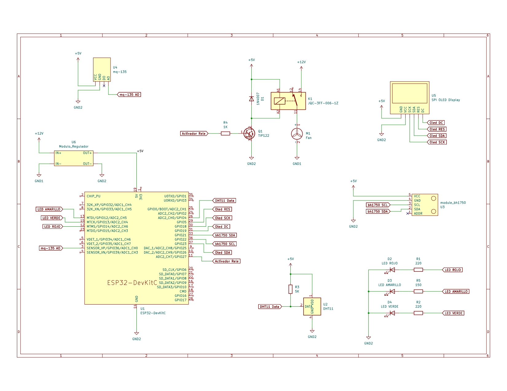
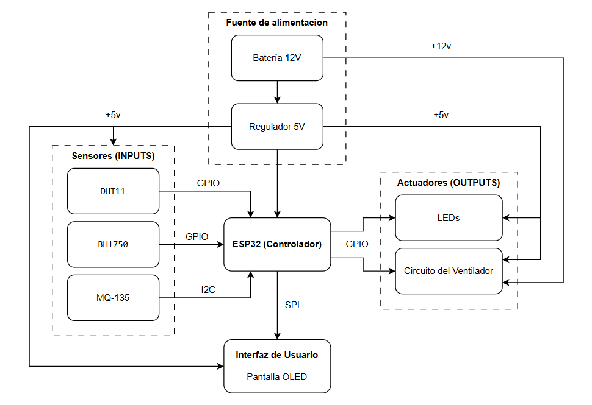

# 🌡️ Sistema de Monitoreo Ambiental con ESP32

Este proyecto implementa un sistema de monitoreo ambiental utilizando un **ESP32** y varios sensores para medir temperatura, humedad, calidad del aire y luminosidad. Los datos son visualizados en una pantalla OLED SSD1306, y se controla un sistema de ventilación mediante relés.

---

## 🧠 Descripción General

El sistema está diseñado para obtener información ambiental en tiempo real y actuar automáticamente ante condiciones específicas.  
Incluye sensores para:
- **Temperatura y humedad:** DHT11 / DHT22  
- **Luz ambiental:** BH1750  
- **Calidad del aire:** MQ-135  

---

## ⚙️ Componentes Principales

| Componente | Descripción | Conexiones GPIO |
|-------------|--------------|-----------------|
| **DHT11 / DHT22** | Sensor de temperatura y humedad | `GPIO 4` (DATA) |
| **BH1750** | Sensor de luminosidad I2C | `GPIO 21 (SDA)`, `GPIO 22 (SCL)` |
| **MQ-135** | Sensor de calidad del aire (analógico) | `GPIO 36 (A0)` |
| **OLED SSD1306 (128x64)** | Pantalla para mostrar los valores | `GPIO 18 (SCK)`, `GPIO 23 (SDA)`, `GPIO 19 (DC)`, `GPIO 5 (RES)` |
| **Relés SRD-05VDC** | Activación de actuadores de 12V | Controlados mediante TIP122 en `GPIO 27`, `GPIO 12`, `GPIO 13` |
| **TIP122 + 1N4007** | Control de potencia y protección | Transistor NPN + diodo de protección |
| **Fuente de 12V / 5V** | Alimentación de relés y ESP32 | `5V` y `GND` compartidos |

---

## 💵 Costo de los componentes


---

## 🔌 Esquema de Conexiones



---

## 🔀 Diagrama de bloques



---

## 🧩 Configuración del Proyecto (PlatformIO)

Archivo `platformio.ini`:

```ini
[env:featheresp32]
platform = espressif32
board = featheresp32
framework = arduino

lib_deps =
    adafruit/DHT sensor library@^1.4.6
    adafruit/Adafruit Unified Sensor@^1.1.14
    claws/BH1750@^1.3.0
    olikraus/U8g2@^2.35.8

monitor_speed = 115200
```

---

## 🖥️ Funcionamiento

1. El ESP32 lee datos de los sensores conectados.  
2. Los valores de temperatura, humedad, luminosidad y calidad del aire se muestran en la pantalla OLED.  
3. Si se superan ciertos umbrales, se activan los relés mediante transistores TIP122.

---

## 📚 Bibliotecas Utilizadas

- [DHT Sensor Library](https://github.com/adafruit/DHT-sensor-library)  
- [Adafruit Unified Sensor](https://github.com/adafruit/Adafruit_Sensor)  
- [BH1750 Light Sensor](https://github.com/claws/BH1750)  
- [U8g2 OLED Display Library](https://github.com/olikraus/u8g2)